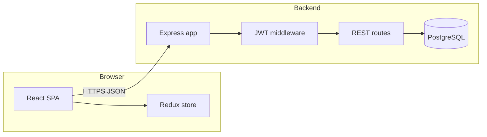

# TaskFlow-Ansh — Technical Documentation

This document explains **how the system is put together**, **how data moves through it**, and **how to extend or debug it**. It is written for reviewers and future maintainers who want more depth than the root `README.md` overview.

---

## Table of contents

1. [Repository layout](#1-repository-layout)
2. [Runtime architecture](#2-runtime-architecture)
3. [Environment variables](#3-environment-variables)
4. [Database schema and migrations](#4-database-schema-and-migrations)
5. [Backend (API)](#5-backend-api)
6. [Frontend (React)](#6-frontend-react)
7. [Authentication and security](#7-authentication-and-security)
8. [Optional / bonus features implemented](#8-optional--bonus-features-implemented)
9. [Responsive UI and design tokens](#9-responsive-ui-and-design-tokens)
10. [Testing](#10-testing)
11. [Docker and operations](#11-docker-and-operations)
12. [Troubleshooting](#12-troubleshooting)

---

## 1. Repository layout

| Path                    | Role                                                                                      |
| ----------------------- | ----------------------------------------------------------------------------------------- |
| `backend/`              | Express + TypeScript API, PostgreSQL via `pg`, Zod validation, `dbmate` migrations        |
| `frontend/`             | Vite + React 19 + TypeScript, Redux Toolkit, Tailwind CSS, Radix primitives (Label, Slot) |
| `docker-compose.yml`    | Orchestrates Postgres, API, and (full stack) the Vite-built static UI                     |
| `.env.example`          | Template for required variables (never commit real `.env`)                                |
| `docs/DOCUMENTATION.md` | This file                                                                                 |

The monorepo uses **npm workspaces**. Install once from the repo root: `npm install`.

---

## 2. Runtime architecture



- The **frontend** is a single-page application. It stores the JWT and user profile in `localStorage` and attaches `Authorization: Bearer …` on every API call (see `frontend/src/lib/api.ts`).
- The **backend** validates input with **Zod**, persists with **parameterized SQL**, and returns a consistent JSON envelope via `ApiResponse` (see `backend/src/utils/ApiResponse.ts`).
- The **axios response interceptor** unwraps `response.data` from Axios, so the client code often receives the full `{ statusCode, data, message, success }` object; API helpers then read the inner `.data` field again where needed (see `frontend/src/api/tasks.ts` `unwrap()`).

---

## 3. Environment variables

Copy `.env.example` to `.env` at the repo root (and/or `backend/.env` depending on your compose setup). Typical variables:

| Variable       | Used by               | Purpose                                                   |
| -------------- | --------------------- | --------------------------------------------------------- |
| `DATABASE_URL` | Backend / dbmate      | PostgreSQL connection string                              |
| `JWT_SECRET`   | Backend               | Secret for signing JWTs (must not be hardcoded in source) |
| `PORT`         | Backend               | HTTP listen port (often `4000`)                           |
| `VITE_API_URL` | Frontend (build-time) | Base URL for API calls from the browser                   |

The frontend build embeds `VITE_*` at compile time. In Docker, the build stage receives the correct API URL for the browser’s network path.

---

## 4. Database schema and migrations

- Migrations live under `backend/db/migrations/` and are applied with **dbmate** (SQL up/down files).
- Core tables: `users`, `projects`, `tasks` with enums `task_status` and `task_priority`.
- Tasks reference `project_id`, optional `assignee_id`, optional `due_date`, and `creator_id` for delete authorization.

**Important:** schema changes must go through new migration files, not ad-hoc SQL in production.

---

## 5. Backend API

### 5.1 Request validation

`validateRequest(schema)` parses `req.body` with Zod and **replaces** `req.body` with the parsed object. That ensures:

- Unknown fields are stripped (depending on Zod defaults).
- Coercion rules run (e.g. empty assignee string → `null` where configured).

See `backend/src/middlewares/validate.middleware.ts` and `backend/src/validations/task.validation.ts`.

### 5.2 Error format

`ApiError` plus `errorHandler` return JSON like:

- `400` — `{ "error": "validation failed", "fields": { "email": "…" } }`
- `401` — `{ "error": "unauthorized" }` (or message from `ApiError`)
- `403` / `404` — consistent `{ "error": "…" }` shape

### 5.3 Pagination totals (bonus)

- **`GET /projects`** — response `data` includes `{ projects, page, limit, total }`. `total` is `COUNT(DISTINCT p.id)` for projects visible to the user (owner or assignee on a task).
- **`GET /projects/:id/tasks`** — response includes `{ tasks, page, limit, total }`. Filter query parameters `status` and `assignee` apply to both the list and the count. Use `assignee=unassigned` for tasks with `assignee_id IS NULL`.

### 5.4 Project stats (bonus)

- **`GET /projects/:id/stats`** — returns:

```json
{
  "by_status": [{ "status": "todo", "count": 2 }],
  "by_assignee": [{ "assignee_id": "…", "assignee_name": "…", "count": 1 }],
  "unassigned_count": 3
}
```

### 5.5 Graceful shutdown

`backend/src/index.ts` listens for `SIGTERM` / `SIGINT`, closes the HTTP server, then ends the `pg` pool.

---

## 6. Frontend (React)

### 6.1 Routing

`frontend/src/App.tsx` defines:

- Public routes: `/login`, `/register` (lazy-loaded, dedicated skeleton fallback on auth routes).
- Protected shell: `AppLayout` with nested routes for `/projects` and `/projects/:id`.
- Guards: `ProtectedRoute` / `PublicOnlyRoute` read Redux `auth.isAuthenticated`.

### 6.2 State management

| Slice          | Responsibility                                                                         |
| -------------- | -------------------------------------------------------------------------------------- |
| `authSlice`    | JWT, user, login/register/logout                                                       |
| `projectSlice` | Project list (with **pagination meta** + **load more**), stats, CRUD                   |
| `taskSlice`    | Tasks for the current project view, **optimistic updates** for PATCH, `total` from API |
| `userSlice`    | Directory of users for assignee pickers                                                |

### 6.3 Optimistic task updates

When `updateTask` is dispatched:

1. **`pending`** — snapshot the task in `rollbackById`, merge the patch into the list for instant UI.
2. **`fulfilled`** — replace with server truth, clear rollback.
3. **`rejected`** — restore snapshot, surface error string.

### 6.4 Task sheet (create / edit)

`TaskSheet` is a full-height panel on small screens and a fixed **right drawer** from `sm` upward. It supports title, description, status (edit only), priority, assignee, and due date. The backdrop closes the sheet; primary actions use **44px minimum** tap targets on small screens where applicable.

### 6.5 “Soft real-time” (bonus, lightweight)

On the project detail page, when the task sheet is **closed**, an interval (~28s) refreshes tasks and stats **only while the document is visible** (`document.visibilityState === 'visible'`). This avoids WebSockets while still converging when multiple people work on the same project.

**Concurrent edits:** There is no row-level locking or version field (`updated_at` is not used as an optimistic lock). If two users change the same task, **last write wins** at the database; the other client sees the newer state on the next fetch or poll. Task status changes use **optimistic UI** locally and **revert** if the server rejects the PATCH.

---

## 7. Authentication and security

- Passwords are hashed with **bcrypt** (cost per assignment / config in auth service).
- JWT includes claims needed for `requireAuth` (see auth controller / JWT util).
- **401** from the API triggers the axios interceptor: Redux `logout()` and redirect to `/login` if needed.
- **Authorization (server-enforced):** `PATCH` / `DELETE` on a project require **project owner**. `GET /projects/:id`, nested task listing, stats, and task creation require **access** (owner, task assignee, or task creator in that project). `PATCH /tasks/:id` allows **owner, creator, or assignee** of that task. `DELETE /tasks/:id` allows **project owner or task creator** only (per take-home). Unknown or inaccessible projects return **404** or **403** as appropriate.
- **UI:** The frontend hides project rename/delete and task delete controls when the current user is not allowed to perform that action (`owner_id` / `creator_id` compared to the logged-in user), so reviewers see the intended roles without relying on trial-and-error 403s.

---

## 8. Optional / bonus features implemented

| Area     | Feature                                                                                 |
| -------- | --------------------------------------------------------------------------------------- |
| Backend  | Pagination metadata (`total`) on **projects** and **tasks** list endpoints              |
| Backend  | **`GET /projects/:id/stats`** extended with `unassigned_count`                          |
| Backend  | No automated HTTP test suite in-repo (take-home tests were optional; use manual checks) |
| Frontend | **Load more** projects using `append` merges in Redux                                   |
| Frontend | **Stats overview** card on project detail                                               |
| Frontend | **Polling** refresh for tasks + stats (visibility-aware)                                |
| Frontend | **Kanban horizontal scroll** on narrow viewports (`snap-x` columns)                     |
| Frontend | **Dark mode** with persisted theme key (`taskflow-theme`)                               |
| Frontend | **Safe area** padding (`env(safe-area-inset-*)`) on shell, auth, and task sheet         |
| UI       | Layered **shadows** via `.shadow-elevated` and refined `Card` ring                      |

**Not implemented (would need more scope):**

- WebSocket / SSE push (browser `EventSource` cannot send `Authorization` headers cleanly without cookies or query tokens).
- Full E2E browser suite (Playwright).

---

## 9. Responsive UI and design tokens

- **Typography:** Red Hat Display (headings) + Red Hat Text (body), wired in `globals.css` and Tailwind `fontFamily`.
- **Colors:** CSS variables in HSL form under `:root` / `.dark`; Tailwind maps `background`, `foreground`, `primary`, etc.
- **Shadows:** `.shadow-elevated` in `globals.css` provides a restrained two-layer shadow + hairline ring; tuned separately for `.dark`.
- **Breakpoints:** Tailwind defaults (`sm`, `md`, `lg`). Critical layouts:
  - **Project board:** horizontal scroll under `md`, grid from `md` up.
  - **Project list:** single column on phones; grid from `sm` / `lg`.
  - **Task sheet:** full viewport height on phones; right rail from `sm`.

---

## 10. Testing

There is **no automated test suite** in this repo (the take-home listed backend tests as an **optional** bonus). Verification is manual: run the stack, exercise auth, projects CRUD, tasks with filters and assignee, and the board drag-and-drop path.

---

## 11. Docker and operations

- `docker compose up --build` should start Postgres, run migrations (per your compose command / entrypoint), start the API, and serve the frontend.
- Logs: backend uses **pino**; HTTP access lines go through **morgan** into the same logger stream.

---

## 12. Troubleshooting

| Symptom                            | Likely cause                                                                                                                                        |
| ---------------------------------- | --------------------------------------------------------------------------------------------------------------------------------------------------- |
| Blank API responses in UI          | Double-unwrap mismatch — check `apiClient` interceptor vs `tasksApi` / `projectsApi` helpers                                                        |
| 401 loop on login                  | Wrong `VITE_API_URL` or CORS; JWT rejected                                                                                                          |
| Tasks not updating assignee        | Request body keys must be snake_case (`assignee_id`); validation middleware must assign parsed body                                                 |
| “Load more” does nothing           | Already loaded all projects (`items.length >= total`)                                                                                               |
| Theme flashes wrong on first paint | Theme is read in `ThemeProvider` state initializer; optional future improvement: inline script in `index.html` to set `class` before React hydrates |

---

## Document history

This file is maintained alongside code changes. When you add endpoints, new env vars, or meaningful UX flows, update **this document** and the shorter **root `README.md`** so reviewers can follow your intent without spelunking the entire tree.
